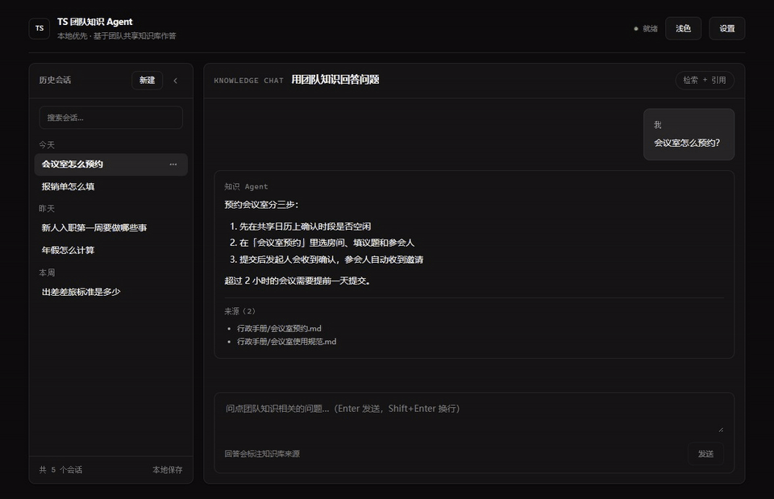
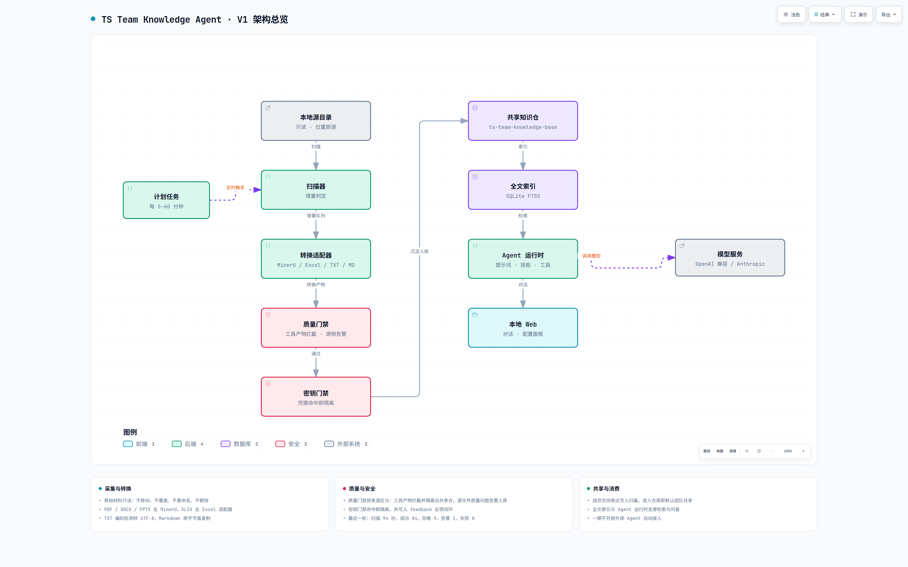

# TS 团队知识 Agent（ts-team-knowledge-agent）

本地运行的团队知识生产与问答应用：扫描成员本机的源目录，把材料转成 Markdown 沉淀进共享知识仓，并基于这些知识回答问题、给出可追溯来源。

本仓只放**应用代码**，不放团队知识内容（知识在 `ts-team-knowledge-base`）。



> 演示使用示例数据，不是真实知识内容。

## 它能做什么

```text
扫描本地源目录 → 按格式路由转换 → 质量与凭据门禁 → 写入个人知识空间
→ 建立全文索引 → 可选同步到共享 Git 仓
→ Web / CLI 基于知识库问答，回答附带来源
```

## 架构总览



采集与转换在本地完成，产物写入共享知识仓后再建立索引；问答由 Agent 运行时结合检索结果与模型服务给出，回答附带来源。分层与边界说明见 [docs/architecture-v1.md](docs/architecture-v1.md)。

## 技术栈

| 层 | 选型 |
| --- | --- |
| 前端 | React 18 + TypeScript + Vite（原生 CSS + 设计 token） |
| Markdown 渲染 | react-markdown + remark-gfm |
| 后端 | Python 3.11 + FastAPI |
| 索引 | SQLite + FTS5（FTS 优先 + 子串兜底） |
| 转换 | MinerU（独立环境，仅 PDF / Office）、Text / Markdown 直接处理 |
| 模型 | OpenAI 兼容或 Anthropic，二者可配 |
| 流程编排 | 自建 CLI + 本地计划任务 |

详见 [docs/frontend-stack.md](docs/frontend-stack.md)。

## 支持的格式

```text
.pdf / .docx / .pptx / .xlsx  → MinerU 转换
.txt                          → 编码检测后转 UTF-8 Markdown
.md                           → 原字节复制
其它扩展名                     → 扫描登记后忽略，不转换、不入库
```

Excel 额外按工作表拆分，大表按 5000 行分片。

## 快速开始

```bash
# 1. 安装（后端只装本包，不拉取 MinerU 等重依赖）
git clone <应用仓地址> ts-team-knowledge-agent && cd ts-team-knowledge-agent
.venv\Scripts\python.exe -m pip install -e . --no-deps

# 2. 构建前端产物（一次性，需要 Node）
cd frontend && pnpm install && pnpm build && cd ..

# 3. 初始化：生成配置、克隆共享知识仓，并引导配置模型
ts-team-kb init --working-directory <工作目录> --personal-workspace <成员标识> --shared-source-directory <源目录>

# 4. 启动（默认只监听本机）
ts-team-kb serve
```

详细步骤、前置检查与常见问题见 [docs/local-install-and-serve.md](docs/local-install-and-serve.md)。

## 在新机器上部署（Windows）

项目脚本不写死任何机器路径：`scripts/*.ps1` 用自身位置定位项目根目录，
配置文件通过环境变量或安装器生成的 `.ts-kb-workspace` 指针文件定位。

```powershell
# 1. 克隆应用仓并创建虚拟环境
python -m venv .venv
.\.venv\Scripts\python.exe -m pip install -e .

# 2. 初始化工作目录（源目录、工作目录、共享知识仓按本机情况指定）
.\.venv\Scripts\ts-team-kb.exe init --personal-workspace <成员> `
    --shared-source-directory <本机源目录> --working-directory <本机工作目录>

# 3. 安装启动器与定时任务（可重复执行，会重新生成启动器并刷新任务）
$env:TS_KB_CONFIG = "<本机工作目录>\ts-kb.json"
.\scripts\install-windows-tasks.ps1
```

安装器会写入 `.ts-kb-workspace` 指针、生成隐藏启动器，并注册三个任务：
`TSKnowledgeAgentScheduler`（周期扫描）、`TSKnowledgeAgentInspection`（每日巡检）、
`TSKnowledgeAgentWebService`（登录自启 Web 服务）。任务均为登录后运行；
启动失败会写入 `logs/runner-errors.log`，不会静默失败。

维护机若还需要每周评测（内容层，会调用模型），加 `-IncludeMaintenance` 一并注册：
`scripts\install-windows-tasks.ps1 -IncludeMaintenance`。成员侧不需要，也不必加。

服务控制（安装后随时可用）：

```powershell
ts-team-kb service status     # 端口 / 进程 / 健康状态
ts-team-kb service start      # 启动（已在运行则直接返回）
ts-team-kb service stop       # 停止
ts-team-kb service restart    # 重启
```

`ts-team-kb init` 在 Windows 上默认安装计划任务；需要跳过时加 `--skip-scheduled-tasks`。

## 常用命令

```text
ts-team-kb serve          启动 Web 界面与 API（默认 127.0.0.1:8088）
ts-team-kb run-once       跑一轮：扫描 → 转换 → 门禁 → 索引 →（--sync）推送
ts-team-kb run-once --if-due   只在达到扫描间隔时执行
ts-team-kb search <关键词>      检索知识
ts-team-kb read <path>          读取文档（分页）
ts-team-kb list                 列出已索引文档
ts-team-kb status               转换状态与失败清单
ts-team-kb ask "<问题>"         命令行问答（检索 + 引用）
ts-team-kb config show|set|set-key   查看 / 修改模型配置与密钥
ts-team-kb schemas --output <dir>    导出知识条目 / 来源登记 / 审查记录格式
ts-team-kb inspect [--per-type N] [--if-due]    结构巡检并发布治理记录
ts-team-kb evaluate --mode retrieval|citations   检索与引用评测（citations 调模型）
ts-team-kb prune            清理本机系统产物（默认 dry-run，删最旧；不动会话库与埋点）
ts-team-kb setup-mineru    制备 MinerU 转换环境（建环境 + 安装 + 自检 + 写配置）
ts-team-kb usage [--days N] [--suggest]          埋点指标与评测题候选
ts-team-kb service start|stop|restart|status     本地 Web 服务启停与状态
```

## 工作区与数据边界

```text
源目录            只读；应用不移动、不覆盖、不删除源文件
工作目录          配置、运行日志、反馈、密钥、隔离产物
共享知识仓        Git 仓库，知识内容与登记文件
会话与历史        本机 SQLite：<工作目录>/data/sessions.sqlite3，属个人使用痕迹，不进共享仓
```

关键约定：

```text
知识输出结构      <文档名>/<文档名>.md + images/（Excel 另有 sheets/）
登记文件          registries/<成员>/sources.jsonl、knowledge.jsonl、reviews.jsonl
索引与状态        SQLite 只在本机，永不进入 Git
会话消息结构      user / process / answer / error 四类；answer 保留检索引用与工具过程
密钥              <工作目录>/secrets/model.key，不在任何 Git 仓库内
```

## 质量与安全门禁

```text
质量门禁    空内容 / 乱码 / 无效 UTF-8 / 过短 / 缺标题 → 不入库，可重试
凭据门禁    命中 sk- 密钥、真实 Bearer、apiKey 字段、私钥等 → 隔离输出并阻断同步
来源登记    每条知识记录来源文件、SHA-256、转换器版本
审查记录    问题以结构化记录留痕（registries/<成员>/reviews.jsonl）
```

## 运行方式

- 登录自启：计划任务 `TSKnowledgeAgentWebService` 在用户登录后拉起本地 Web 服务
  （`run-web-service-hidden.vbs` → `scripts/run-web-service.ps1`，端口已占用时直接跳过，可重复执行）。
- 定时任务错过后唤醒补跑：`TSKnowledgeAgentScheduler` 与 `TSKnowledgeAgentInspection` 均启用
  `StartWhenAvailable`，并各自按 `--if-due` 判断是否真正执行。

```text
自动    本地计划任务定时唤醒，按 scan_interval_minutes（默认 60，下限 5）决定是否执行
手动    Web 设置面板：立即扫描、拉取 / 推送共享知识仓、调整扫描间隔
Web     深色（默认）/ 浅色主题可切换；回答渲染为 Markdown 并列出来源
```

## 目录结构

详见 [docs/project-structure.md](docs/project-structure.md)。

## 相关文档

```text
docs/architecture-v1.md        应用架构与分层
docs/design-v1.md              一期设计要点与固定约束
docs/project-structure.md      工程结构规范
docs/roadmap.md                阶段进展与后续计划
docs/logging-v1.md             日志与运行记录
docs/frontend-stack.md         前端技术栈定稿
docs/local-install-and-serve.md 本地安装与启动
agent/                         给编码 Agent 的规范（入口 AGENT.md / CLAUDE.md）
```

## 开发约定

```text
分支      main 为稳定分支；日常开发在 dev，验证通过后再合并
验证      改代码后跑后端 pytest 与前端 typecheck / vitest / build
提交      不提交密钥、日志、数据库、临时产物；提交前检查 diff
```

## 治理记录边界

个人知识空间只存放该成员共享的知识；巡检与治理留痕单独存放，两者不交叉。

- 知识：`members/<成员>/`，参与检索与登记表生成
- 治理：`governance/<成员>/`（巡检报告与运行健康度），不参与检索与登记表生成
- 本机运行日志（`logs/`、`feedback/`）留在工作目录，不进入共享仓

动手巡检并写入共享仓：

```bash
ts-team-kb inspect --per-type 6        # 抽样巡检并发布治理记录
ts-team-kb inspect --no-publish        # 只写本机报告
```

初始化时同时建好个人知识目录与治理目录；每日 08:30 由计划任务
`TSKnowledgeAgentInspection` 自动巡检一次，报告随下一轮同步推给团队。

## 使用埋点与质量改进

每次问答（Web 对话与 CLI `ask`）都会静默记录一条链路，用于改进检索与提示词：

```text
记录内容    用户原话 → 模型实际发出的检索词（可能多次）→ 每次命中的文档
            → 最终引用 → 零命中的查询 → 步数 / 答案长度 / 错误
本地明细    <工作目录>/logs/usage/<日期>.jsonl
共享汇总    governance/<成员>/usage/<年月>.jsonl（按天一条，随知识仓同步推送）
开关        无：静默记录，不对外提供关闭入口，成员无需任何操作
```

用途：

```bash
ts-team-kb usage --days 7            # 零命中率 / 引用率 / 平均步数
ts-team-kb usage --suggest           # 由零命中与坏例生成评测题候选
ts-team-kb evaluate --mode retrieval  # 纯检索评测（不调模型）
ts-team-kb evaluate --mode citations  # 端到端引用评测（调模型）
```

改进闭环：真实提问 → 埋点 → 每周评测 → 零命中查询沉淀为评测题 → 调检索/提示词
→ 同一题集回归对比，达标才提交。评测报告写入 `governance/<成员>/evaluation/`。

## 会话与历史消息

```text
存储位置    <工作目录>/data/sessions.sqlite3（本机 SQLite，不进入共享知识仓）
保存内容    用户提问、工具过程（步骤名与摘要）、回答（正文 + 检索引用 + 步数 + 是否检索）、错误
不保存      凭据、源文件内容；回答正文只落本机
```

接口：

```text
GET  /api/v1/sessions                    会话列表（id、title、updatedAt 毫秒时间戳）
POST /api/v1/sessions                    新建会话
GET  /api/v1/sessions/{id}/messages      历史消息（含引用与工具过程，可直接回放）
GET  /api/v1/sessions/search?q=         历史消息全文检索（返回会话、消息类型与命中片段）
PATCH  /api/v1/sessions/{id}             重命名（body {"title": "..."}；超 20 字自动截断，空标题拒绝）
DELETE /api/v1/sessions/{id}             删除会话及其全部消息
POST /api/v1/chat、/api/v1/chat/stream   接受 session_id，落库用户消息、工具过程与回答
```

行为约定：

```text
标题        上限 20 字；首条提问自动成为标题，人工重命名走同一套规范化，前端以服务端为准
历史加载    切换会话时按需拉取一次；已加载过的会话不再覆盖，避免抹掉在途消息
边界        会话属于个人使用痕迹，接口只读本机库，不参与检索索引与共享仓同步
```

## 已知环境注意事项

```text
公司 DLP（E-SafeNet）会对部分文件做透明加解密：
  · git、node、python 读取得到明文
  · PowerShell 的 .NET 文件 API 可能读到密文
排查文件内容时优先用 git show 或 Python/Node 读取，不要用 PowerShell 直接读字节，
否则会把正常文件误判为"损坏"。
```

### 典型报错

```text
PermissionError: [Errno 13] Permission denied             读取被拒
error: unable to unlink old '<file>': Invalid argument     git 无法替换该文件
文件开头出现 E-SafeNet / LOCK 的二进制内容                 读到的是密文而不是内容
```

### 文件被锁住时

```text
1. 关掉可能打开该文件的程序（编辑器、预览工具）——多数情况即时释放
2. 仍锁定：注销再登录
3. 仍锁定：重启机器
4. 都无效：找 IT。不要自行卸载或禁用，这是公司合规管控
```

### Git 侧临时手段

某个被锁文件阻塞提交时，可临时跳过它的本地变更（仓库内已提交的内容仍是正确明文）：

```bash
git update-index --skip-worktree <path>     # 临时跳过本地变更
git update-index --no-skip-worktree <path>  # 恢复正常跟踪
git checkout -- <path>                      # 用仓库版本覆盖本地
```

`git ls-files -v <path>` 输出以 `S` 开头即表示当前处于跳过状态。
## 巡检与评测的任务归属

```text
用户侧（成员机器）  ts-team-kb init 会安装三个计划任务：定时扫描、每日巡检、本地服务（登录自启），
                    这是日常使用所需
维护侧（维护机）    每周评测不安装到成员机器；维护机用
                    scripts\install-windows-tasks.ps1 -IncludeMaintenance 启用
                    · 每周评测（内容层，调模型，汇总真实提问与引用质量）
                    · 保留每周评测的报告发布到自己的治理目录
```

两部分都按 `--if-due` 判定到期，并通过 `StartWhenAvailable` 在关机/休眠后补跑一次。

## 发布与分发

```text
构建发布产物   python scripts/build-release.py --exe --build-python <含 PyInstaller 的解释器>
               → dist-release/<wheel>（pip/pipx 分发）与 ts-team-kb-<版本>-win-x64.zip（免安装包）
发布到 Release python scripts/publish-release.py --tag v<版本> --prerelease --apply
               （默认 dry-run；上传后回读资产校验大小与 state）
产物特性       免安装包内含 Python 运行时 + 应用 + 前端产物，成员机不需要装 Python 或 Node；
               不含 MinerU（torch 约 1.1GB，转换走独立解释器），需单独制备，见 docs/local-install-and-serve.md
```
